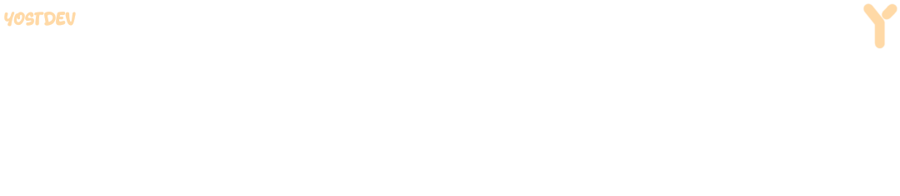

<h1 align="center">¡Hola! Soy Fabian, alias YostDev</h1>
<h3 align="center">Desarrollador de paginas y aplicaciones web</h3>

<!-- Contador de visitas -->

  

### 👨‍💻 Un poco sobre mí

Un breve texto sobre ti. Aquí puedes contar de dónde eres, qué te apasiona o qué estás aprendiendo actualmente.

---

**Mis Habilidades**

 

---

**Contáctame**

[✉️ Correo Electrónico](mailto:tu-correo@email.com) | [🌐 Mi Portafolio](https://tu-sitio-web.com)

